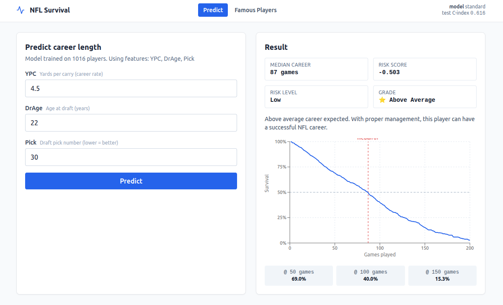

# 🏈 NFL Running Back Career Survival Analysis

<div align="center">


**딥러닝 기반 생존 분석으로 NFL 러닝백의 커리어 길이를 예측하는 풀스택 프로젝트**

</div>

---

## 📸 데모

<div align="center">



</div>

---

## 🎯 프로젝트 소개

이 프로젝트는 **TensorFlow 기반의 DeepSurv 신경망**으로 NFL 러닝백의 커리어 길이(총 출전 경기 수)를 예측합니다. 기존 R 기반 Cox Proportional Hazards 모델을 딥러닝으로 전환하고, 학습된 모델을 **FastAPI** 로 서빙하며 **React + TypeScript** 웹 UI 에서 사용할 수 있도록 구성한 풀스택 애플리케이션입니다.

### 🎓 원본 프로젝트
- **출처**: [github.com/johnrandazzo/surv_nflrb](https://github.com/johnrandazzo/surv_nflrb)
- **저자**: Brian Luu, Kevin Wang, John Randazzo
- **기술**: R, Cox PH, Kaplan-Meier
- **데이터**: Pro-Football-Reference.com

---

## ✨ 주요 특징

| 영역 | 내용 |
|------|------|
| 🧠 **모델** | DeepSurv (Cox Partial Likelihood Loss) + Breslow baseline |
| 📊 **데이터** | 자동 전처리 파이프라인 (특징 엔지니어링, 이상치/결측치 처리) |
| 🔮 **추론** | 단일 / 배치 / 유명 선수 일괄 예측 |
| 🎨 **시각화** | Kaplan-Meier 곡선, 위험 그룹별 비교, 개별 생존 곡선 |
| 🌐 **API** | FastAPI + Pydantic v2 (`/health`, `/predict`, `/players/famous`) |
| 💻 **UI** | React 18 + Vite + Recharts + React Query |

---

## 📁 프로젝트 구조

```
nfl_survival_tensorflow/
│
├── backend/                          # 🐍 Python 백엔드
│   ├── app/                          # FastAPI 애플리케이션
│   │   ├── api/                      # 라우터 (health, predict, players)
│   │   ├── services/                 # ModelService (모델 싱글톤)
│   │   ├── config.py                 # CORS, MODEL_PATH, FEATURE_RANGES
│   │   ├── schemas.py                # Pydantic 요청/응답 스키마
│   │   └── main.py                   # FastAPI 엔트리 포인트
│   │
│   ├── data_preprocessing.py         # NFLDataPreprocessor
│   ├── model_architecture.py         # DeepSurv (Keras 래퍼)
│   ├── model_training.py             # ModelTrainer / EnsembleTrainer
│   ├── prediction_utils.py           # PlayerPredictor / FamousPlayersPredictor
│   ├── visualization.py              # SurvivalVisualizer
│   ├── train_cli.py                  # 학습 파이프라인 CLI
│   ├── nfl.csv                       # 데이터셋
│   └── requirements.txt
│
├── frontend/                         # ⚛️ React + Vite 프런트엔드
│   ├── src/
│   │   ├── api/                      # fetch 클라이언트 / 타입
│   │   ├── hooks/queries.ts          # React Query 훅
│   │   ├── components/               # Header, SurvivalChart, ErrorBoundary
│   │   ├── pages/                    # PredictPage, FamousPage
│   │   └── App.tsx
│   ├── package.json
│   └── vite.config.ts
│
├── docs/                             # 📚 설계 문서
│   ├── architecture.md               # 시스템 아키텍처
│   └── uml.md                        # UML 다이어그램 (Mermaid)
│
├── README.md                         # 이 파일
└── LICENSE
```

> 더 자세한 설계는 [`docs/architecture.md`](docs/architecture.md) 와 [`docs/uml.md`](docs/uml.md) 를 참고하세요.

---

## 🚀 빠른 시작

### 사전 요구사항
- **Python** 3.9 이상
- **Node.js** 18 이상 (npm 9+)
- **OS**: Windows 10+, macOS 10.14+, Ubuntu 18.04+
- **RAM**: 8GB 이상 권장 (학습 시)

### 1️⃣ 백엔드 설정

```bash
cd backend

# 가상환경 생성 (선택)
python -m venv .venv
source .venv/bin/activate            # Windows: .venv\Scripts\activate

# 의존성 설치
pip install -r requirements.txt
```

### 2️⃣ 모델 학습 (최초 1회)

```bash
# backend/ 에서 실행
python train_cli.py
```

학습이 완료되면 `backend/output/` 에 다음 파일이 생성됩니다.
- `deepsurv_model_model.h5` — Keras 가중치
- `deepsurv_model_meta.pkl` — scaler, baseline survival, feature_names, metrics
- 학습 곡선 및 KM 그래프 PNG

### 3️⃣ API 서버 실행

```bash
# backend/ 에서 실행
uvicorn app.main:app --reload --port 8000
```

서버가 정상 기동되면 다음 엔드포인트를 사용할 수 있습니다.

| 엔드포인트 | 메서드 | 설명 |
|------------|--------|------|
| `/api/health` | GET | 모델 메타데이터 / 로딩 상태 |
| `/api/predict` | POST | 단일 선수 예측 |
| `/api/players/famous` | GET | 유명 RB 일괄 예측 |
| `/docs` | GET | Swagger UI |

### 4️⃣ 프런트엔드 실행

```bash
cd frontend

# 의존성 설치
npm install

# 개발 서버 (http://localhost:5173)
npm run dev
```

브라우저에서 `http://localhost:5173` 으로 접속하면 예측 폼과 유명 선수 페이지를 사용할 수 있습니다.

---

## 💻 사용 방법

### 🌐 웹 UI 사용

1. **Predict 페이지** — BMI, YPC, Draft Age, Pick, Round 입력 → Submit
   - 위험 점수, 예상 커리어(중앙 생존 시간), 등급 표시
   - 생존 확률 곡선 (Recharts) 렌더링
   - 학습 데이터 IQR 범위를 벗어나면 외삽 경고 표시
2. **Famous Players 페이지** — LaDainian Tomlinson, Emmitt Smith, Barry Sanders 등 유명 RB 들의 예측 vs 실제 비교

### 🔌 API 직접 호출

```bash
# 헬스체크
curl http://localhost:8000/api/health

# 단일 예측
curl -X POST http://localhost:8000/api/predict \
  -H "Content-Type: application/json" \
  -d '{
    "features": {"BMI": 29.0, "YPC": 4.5, "DrAge": 22, "Pick": 30, "Rnd": 2},
    "max_games": 200
  }'
```

### 🐍 Python 모듈로 직접 사용

```python
from data_preprocessing import NFLDataPreprocessor
from model_architecture import DeepSurv
from model_training import ModelTrainer
from prediction_utils import PlayerPredictor

# 1. 데이터 전처리
preprocessor = NFLDataPreprocessor('nfl.csv')
df = preprocessor.preprocess()
X, y_event, y_time = preprocessor.get_feature_matrix()

# 2. 모델 생성 및 학습
model = DeepSurv(input_dim=X.shape[1], hidden_layers=[64, 32, 16], dropout_rate=0.3)
model.compile(learning_rate=0.001)

trainer = ModelTrainer(model)
X_train, X_test, ye_tr, ye_te, yt_tr, yt_te = trainer.train_test_split_data(X, y_event, y_time)
trainer.train(X_train, ye_tr, yt_tr, epochs=100)
metrics = trainer.evaluate(X_train, ye_tr, yt_tr, X_test, ye_te, yt_te)

# 3. 예측
predictor = PlayerPredictor(model)
result = predictor.predict_player(features={'BMI': 29.0, 'YPC': 4.5, 'DrAge': 22})
print(f"위험 점수: {result['risk_score']:.3f}")
print(f"예상 커리어: {result['median_survival']} 경기")
print(f"등급: {result['interpretation']['grade']}")
```

---

## 🧠 모델 설명

### DeepSurv 아키텍처 (standard)

```
Input (D features)
   │
   ▼
Dense(64, ReLU) → BatchNorm → Dropout(0.3)
   │
   ▼
Dense(32, ReLU) → BatchNorm → Dropout(0.3)
   │
   ▼
Dense(16, ReLU) → BatchNorm → Dropout(0.3)
   │
   ▼
Dense(1, Linear)  →  η (Risk Score)
```

선택 가능한 변형: `standard`, `deep` (`[128,64,32,16,8]`), `wide` (`[256,128,64]`), `simple` (`[32,16]`)

### 손실 함수 — Cox Partial Likelihood

$$
\mathcal{L}(\theta) = -\sum_i \delta_i \left[ \eta_i - \log \sum_{j \in R_i} \exp(\eta_j) \right]
$$

- $\delta_i$: 이벤트(은퇴) 발생 여부
- $\eta_i$: 신경망이 출력한 위험 점수
- $R_i$: 시점 $t_i$ 의 위험 집합(risk set)

### 추론 시점 생존 함수

학습 종료 후 **Breslow 추정량** 으로 baseline survival $S_0(t)$ 를 계산하여 메타파일에 저장합니다. 추론 시 개별 선수의 생존 확률은 다음과 같이 계산됩니다.

$$
S(t \mid X) = S_0(t)^{\exp(\eta(X))}
$$

### 주요 특징(Feature)

| 특징 | 의미 | 영향 방향 |
|------|------|-----------|
| **BMI** | 체질량지수 (`Weight / Height² × 703`) | 높을수록 커리어 ↑ |
| **YPC** | Yards Per Carry (`Yds / Att`) | 높을수록 커리어 ↑ |
| **DrAge** | 드래프트 당시 나이 | 높을수록 커리어 ↓ |
| **Pick** | 드래프트 픽 순번 | 낮을수록 커리어 ↑ |
| **Rnd** | 드래프트 라운드 | 낮을수록 커리어 ↑ |

---

## 📊 모델 성능

| 지표 | 값 | 설명 |
|------|-----|------|
| **Test C-index** | 0.59 – 0.62 | 예측 정확도(쌍 일치도) |
| **Train C-index** | 0.61 – 0.63 | 학습 정확도 |
| **CV Mean C-index** | 0.60 ± 0.03 | 5-Fold 교차 검증 |
| **학습 시간** | 2 – 5분 (CPU) | 약 1000 샘플 기준 |

### C-index 해석

- **0.7 이상** ⭐⭐⭐ 우수
- **0.6 – 0.7** ✅ 양호 (이 프로젝트)
- **0.5 – 0.6** 보통
- **0.5 이하** 랜덤 수준

### Cox PH vs DeepSurv

| 모델 | C-index | 장점 | 단점 |
|------|---------|------|------|
| Cox PH | 0.591 | 해석 용이, 단순 | 선형 가정 |
| **DeepSurv** | **0.605** | 비선형 패턴 학습 | 모델 복잡도 ↑ |

---

## 🔍 주요 발견사항

1. **YPC가 가장 중요** — 경기력이 커리어 길이에 결정적
2. **BMI는 생존력과 관련** — 단단한 체격이 부상 예방에 도움
3. **Draft Age는 영향이 작음** — 재능이 나이보다 중요

---

## 🛠 기술 스택

### Backend
- **Deep Learning**: TensorFlow 2.10+, Keras
- **Survival Analysis**: lifelines (Kaplan-Meier, C-index)
- **ML/Data**: scikit-learn, pandas, numpy
- **API**: FastAPI 0.115+, Uvicorn, Pydantic v2
- **Visualization**: matplotlib, seaborn

### Frontend
- **Framework**: React 18 + TypeScript
- **Build**: Vite 5
- **State / Data**: TanStack React Query 5
- **Forms**: React Hook Form + Zod
- **Charting**: Recharts
- **Styling**: Tailwind CSS 3
- **Routing**: React Router 6

---

## 📚 문서

| 문서 | 내용 |
|------|------|
| [`docs/architecture.md`](docs/architecture.md) | 계층형 아키텍처, 모듈 책임, 데이터 흐름, 설계 결정 |
| [`docs/uml.md`](docs/uml.md) | 클래스 / 시퀀스 / 액티비티 / 컴포넌트 / 상태 다이어그램 (Mermaid) |

---

## 🧪 개발 팁

### 백엔드만 빠르게 검증하기

```bash
cd backend
uvicorn app.main:app --reload --port 8000
# 다른 터미널에서
curl http://localhost:8000/api/health | jq
```

### 프런트엔드를 다른 백엔드에 붙이기

`frontend/` 에서 `.env.local` 생성:

```env
VITE_API_BASE_URL=http://your-host:8000/api
```

### 모델 재학습

특징 셋이나 하이퍼파라미터를 바꾼 뒤 `python backend/train_cli.py` 를 다시 실행하면 `backend/output/` 의 아티팩트가 갱신되며, FastAPI 를 재시작하면 새 모델이 로드됩니다.

---

## 📜 라이선스

MIT License — 자세한 내용은 [LICENSE](LICENSE) 참고.

---

## 🙏 감사의 말

- 원본 프로젝트: Brian Luu, Kevin Wang, John Randazzo ([surv_nflrb](https://github.com/johnrandazzo/surv_nflrb))
- 데이터 출처: [Pro-Football-Reference.com](https://www.pro-football-reference.com/)
- DeepSurv 논문: Katzman et al., *DeepSurv: Personalized Treatment Recommender System Using a Cox Proportional Hazards Deep Neural Network* (2018)
