# 📐 UML 다이어그램

NFL 러닝백 커리어 생존 분석 프로젝트의 UML 다이어그램 모음입니다. 모든 다이어그램은 [Mermaid](https://mermaid.js.org/) 문법으로 작성되었으며 GitHub, VS Code 등 대부분의 마크다운 뷰어에서 자동 렌더링됩니다.

---

## 1. 클래스 다이어그램 (Backend)

### 1.1 ML Core 클래스

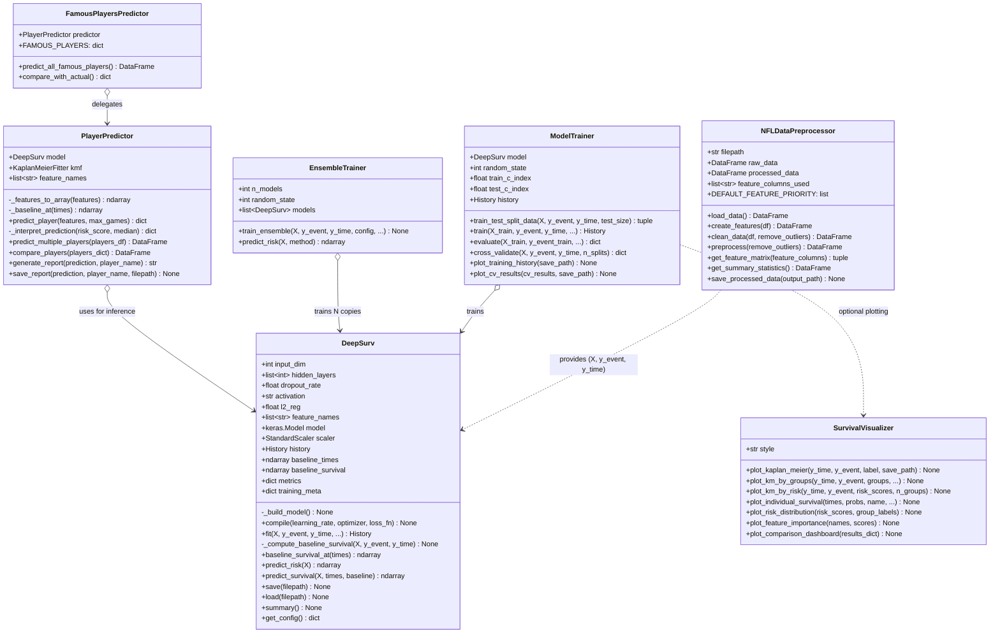

### 1.2 API Layer 클래스

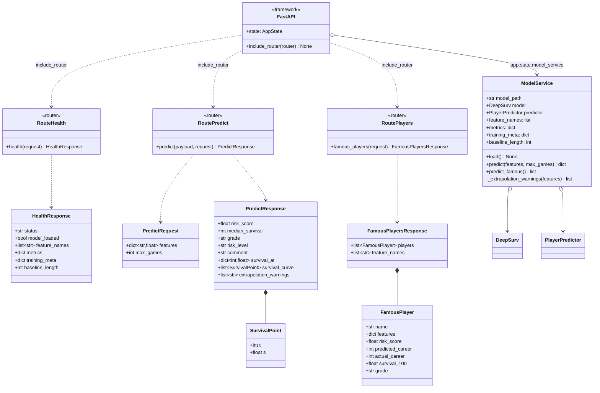

---

## 2. 컴포넌트 다이어그램 (Frontend)

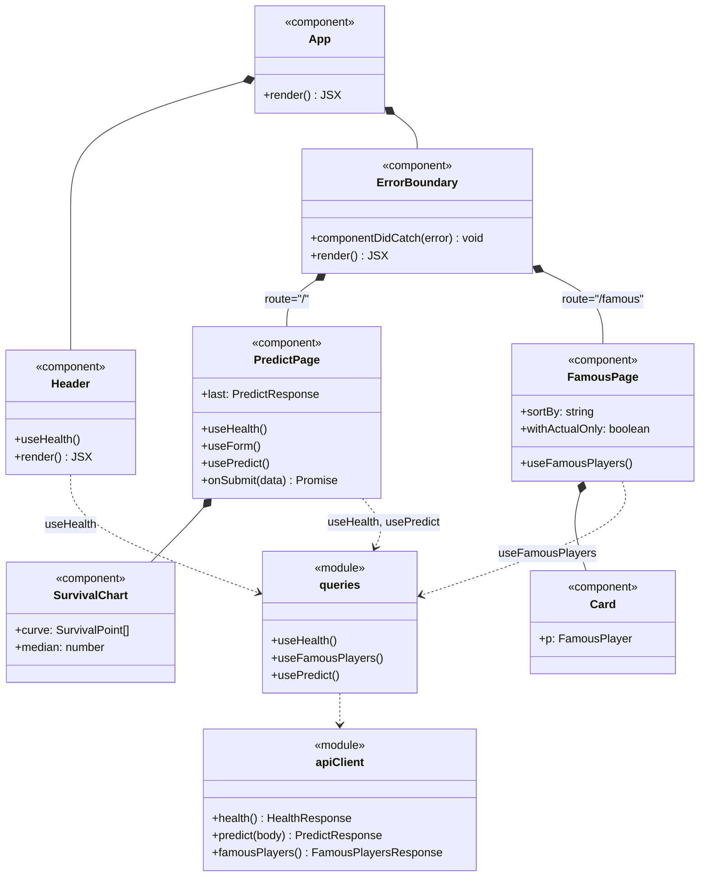

---

## 3. 시퀀스 다이어그램

### 3.1 단일 선수 예측

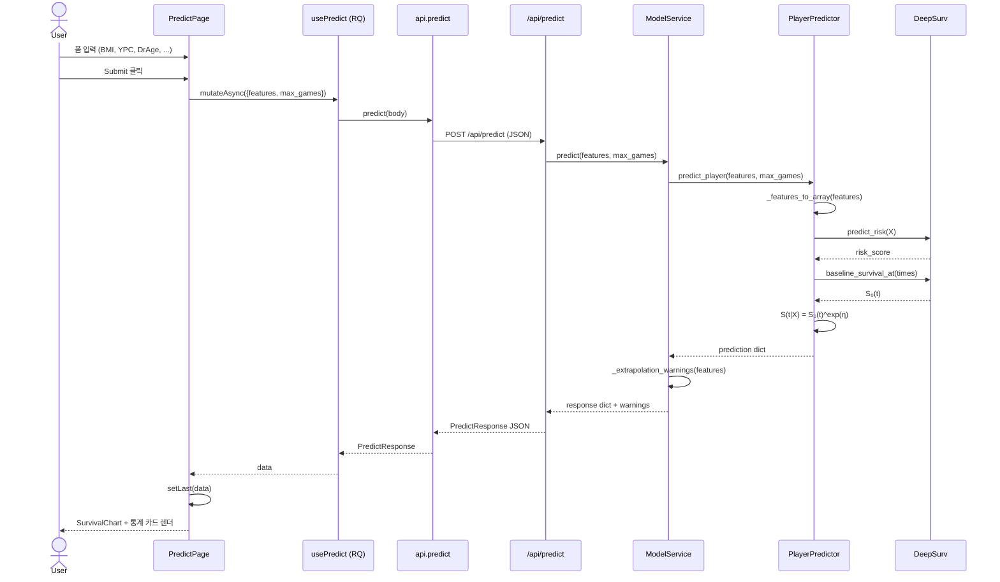

### 3.2 모델 로딩 (앱 시작 시)

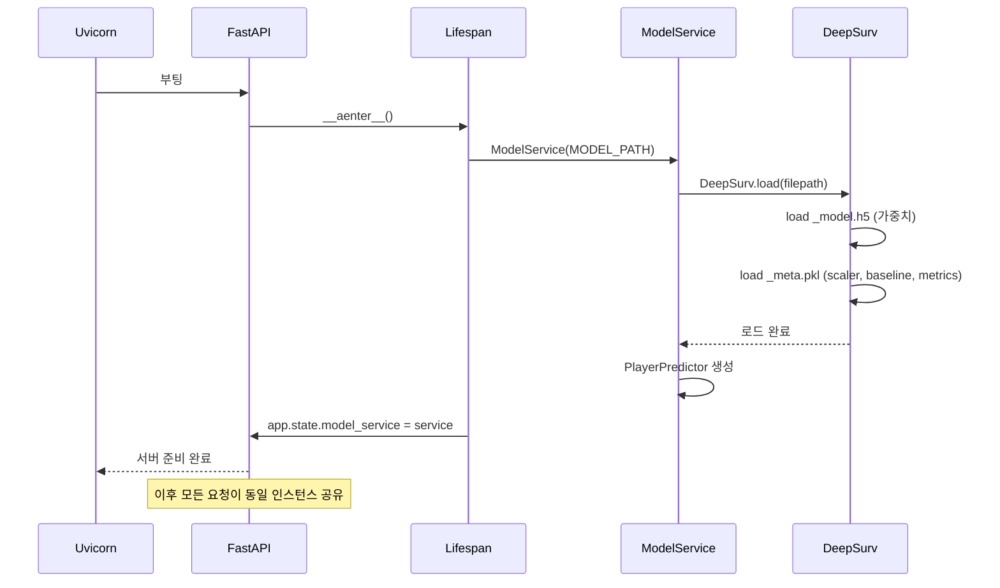

### 3.3 유명 선수 페이지 로딩

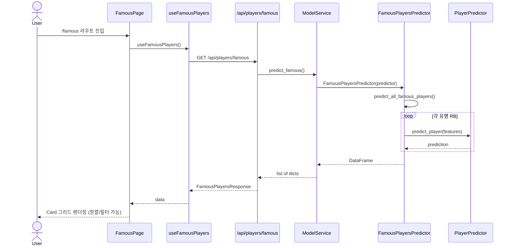

---

## 4. 학습 파이프라인 액티비티 다이어그램

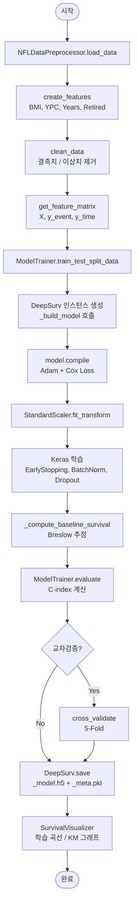

---

## 5. 추론 파이프라인 액티비티 다이어그램

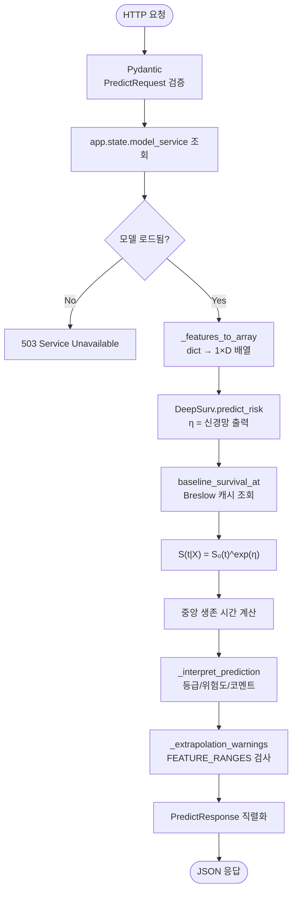

---

## 6. 패키지/모듈 의존성 그래프

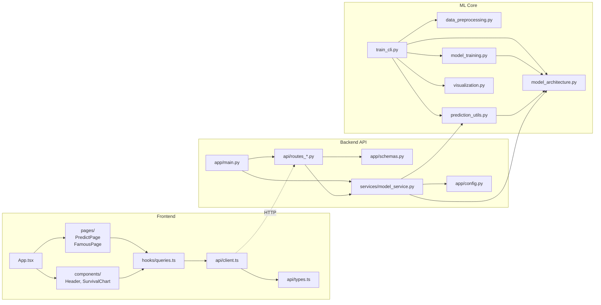

---

## 7. 상태 다이어그램 — 모델 라이프사이클

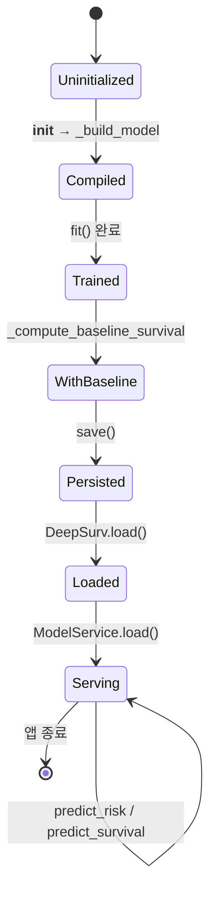

---

## 8. 도메인 엔터티 (ER 스타일)

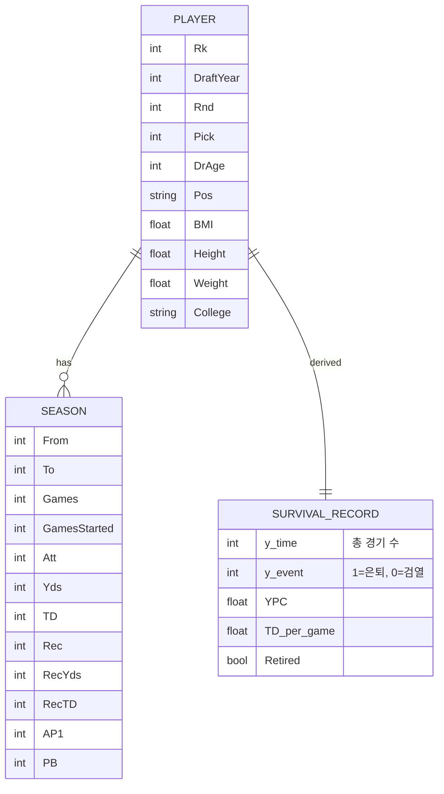

---

## 9. 다이어그램 보는 방법

- **GitHub / GitLab**: `.md` 파일을 열면 Mermaid 코드 블록이 자동으로 렌더링됩니다.
- **VS Code**: [Markdown Preview Mermaid Support](https://marketplace.visualstudio.com/items?itemName=bierner.markdown-mermaid) 확장 사용.
- **JetBrains IDE**: 내장 마크다운 미리보기에서 Mermaid 지원 (2023.2+).
- **CLI 렌더링**: `npx @mermaid-js/mermaid-cli -i uml.md -o uml.svg`

---

## 10. 다이어그램 갱신 가이드

이 문서의 다이어그램은 다음 변경 시 함께 업데이트해야 합니다.

| 변경 내용 | 영향받는 다이어그램 |
|-----------|---------------------|
| 새 클래스/모듈 추가 | §1 클래스 다이어그램, §6 의존성 그래프 |
| API 엔드포인트 추가 | §1.2, §3 시퀀스, §6 의존성 |
| Pydantic 스키마 변경 | §1.2 |
| 프런트 컴포넌트 추가 | §2 |
| 학습/추론 단계 변경 | §4, §5 액티비티 다이어그램 |
| 모델 저장 형식 변경 | §7 상태 다이어그램 |
